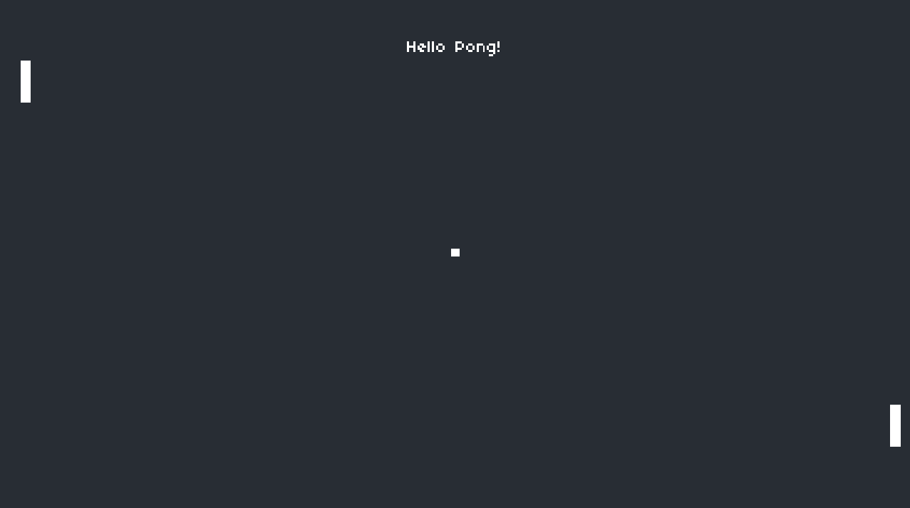

# PONG

Originally programmed by Atari in 1972. Features two paddles, controlled by players, with the goal of getting the ball past your opponent´s edge.
First to 10 points win.

This version is built to more closely resemble the NES that the original Pang machines or the Atari 2600 in terms of resolution, though in widescreen
(16:9) so it looks more like modern systems.

## Lecture´s Scope

-   Draw shapes to the screen (paddles and ball).
-   Control 2D position of paddles based on input.
-   Collision detection between paddles and ball to deflect ball back toward opponent.
-   Collision detection between ball and map boundaries to keep ball within vertical bounds and to detect score (outside horizontal bounds).
-   Sound effects when ball hits paddles/walls or when a point is scored for flavor.
-   Scorekeeping to determine winner.

### Building process

-   [PONG - 0](pong-0)

    Created a 1280x720 window with 'Hello Pong' text align in the center.

-   [PONG - 1](pong-1)

    Created a 432x243 window rendered at 1280x720 with the text being filtered.

    Added 'push' library to make it virtual low res (retro-looking).

-   [PONG - 2](pong-2)

    Added a more retro font and moved the text to the top of the screen.

    Added rectangles to each side (left & right), paddles = players.

    Added square centered, the ball.

    
